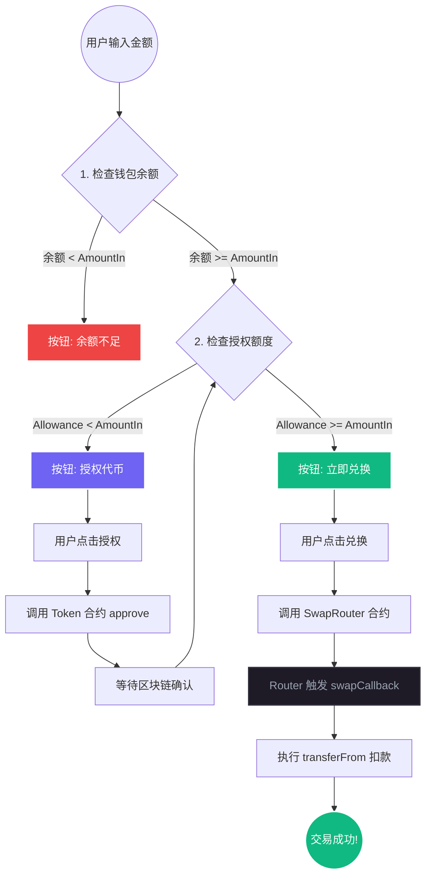

```mermaid
graph TD
    %% 定义样式
    classDef action fill:#6E63F2,stroke:#fff,stroke-width:2px,color:#fff;
    classDef check fill:#1E1B27,stroke:#2F2C38,stroke-width:2px,color:#99A1AF;
    classDef success fill:#10B981,stroke:#fff,stroke-width:2px,color:#fff;
    classDef error fill:#EF4444,stroke:#fff,stroke-width:2px,color:#fff;

    Start((用户输入金额)) --> BalCheck{1. 检查钱包余额}
    
    BalCheck -- "余额 < AmountIn" --> Insufficient[按钮: 余额不足]:::error
    BalCheck -- "余额 >= AmountIn" --> AllCheck{2. 检查授权额度}

    AllCheck -- "Allowance < AmountIn" --> NeedApprove[按钮: 授权代币]:::action
    AllCheck -- "Allowance >= AmountIn" --> Ready[按钮: 立即兑换]:::success

    %% 授权分支
    NeedApprove --> ClickApprove[用户点击授权]
    ClickApprove --> SendApprove[调用 Token 合约 approve]
    SendApprove --> WaitApprove[等待区块链确认]
    WaitApprove --> AllCheck

    %% 兑换分支
    Ready --> ClickSwap[用户点击兑换]
    ClickSwap --> SendSwap[调用 SwapRouter 合约]
    SendSwap --> Callback[Router 触发 swapCallback]:::check
    Callback --> Transfer[执行 transferFrom 扣款]
    Transfer --> SwapDone((交易成功!)):::success
```